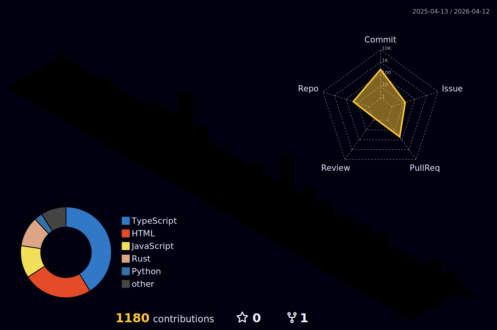

  <!-- Terminal Style Header -->
  

   

  <!-- Clean Typing Effect -->
  

   
   

  <!-- Socials - Minimalist -->
  

    
    
  

   

  <!-- Tech Stack - Clean & Serious -->
  <h3 style="font-family: monospace;">> Technologies</h3>
  
  

    
  

   

  <!-- Stats - Dracula Theme (Dark/Pro) -->
  <h3 style="font-family: monospace;">> Metrics</h3>

  

    

  

   

  <!-- 3D Contributions -->
  <h3 style="font-family: monospace;">> 3D Activity</h3>
  

   

  

    // coding the future, one line at a time.
  

  
   
  

